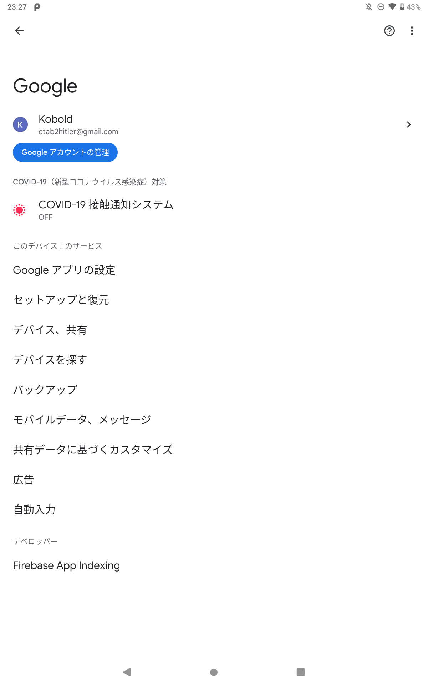
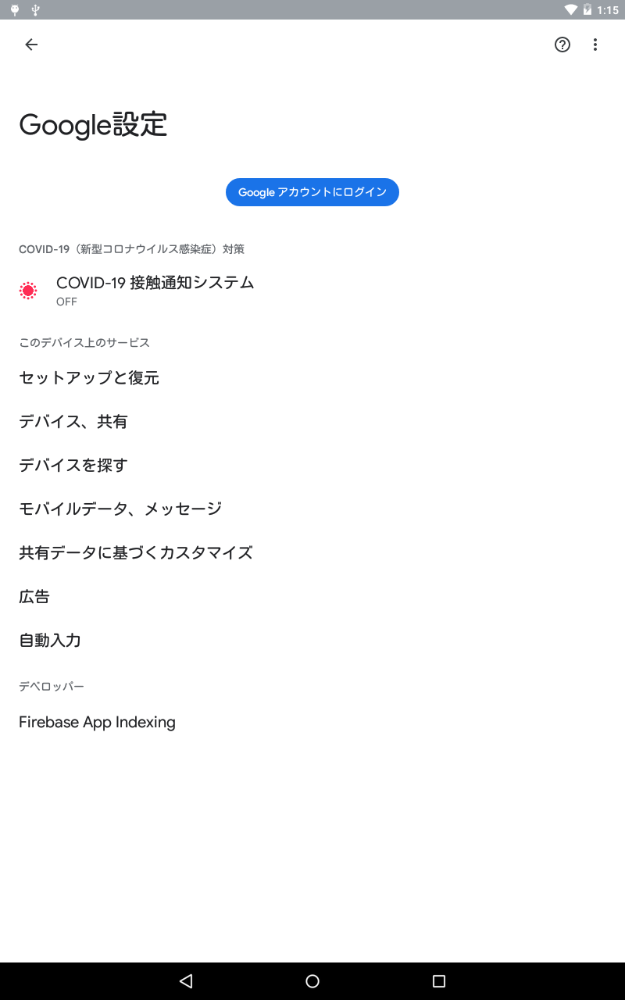

# Enable GPlay With PC

チャレンジパッドで、Google Playの機能の一部を使えるようにするツールです。

## スクリーンショット

画像は開発中のものです。実際の仕様とは異なる場合があります。

<b>チャレンジパッドNeo</b>

<b>チャレンジパッド２</b>

## 注意

> [!NOTE]
> チャレンジパッド2シリーズでは、GAppsを正常に動作させるためにDchaServiceを使用します。（一部の機能は使用できません）
> 
> ※デバッグ中のため将来のバージョンで提供予定
> 
> チャレンジパッド3､ Neoでは、GAppsを完全に動作させることはできません。  
> チャレンジパッドNextの場合は、**完全に動作できます**。

## ダウンロード

[EnableGPlayWithPC](https://drive.usercontent.google.com/download?id=1TpoUzxpshhr7mFDoYffArNWFo9tCWsBD)
