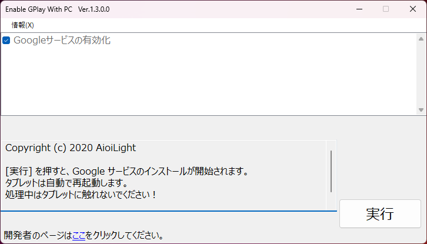

# Enable GPlay With PC

チャレンジパッドで、Google Playの機能の一部を使えるようにするツールです。

## 機能

今後も機能は追加予定です。

### Googleサービスの有効化

この機能は以下のアプリケーションソフトウェアをインストールします。

- Googleサービスフレームワーク
- Google Play開発者サービス
- Google Playストア

## 対応機種

- チャレンジパッド２シリーズ
- チャレンジパッド３
- チャレンジパッドNeo
- チャレンジパッドNext

## 動作要件

このソフトウェアの動作には以下が必要です。

- Windows 7 以降
- .NET Framework 4.8  
  ダウンロードは[**こちら**](https://dotnet.microsoft.com/ja-jp/download/dotnet-framework/net48)  
  ※Windows 7 / 8.1 の場合のみダウンロード＆インストールを行ってください。

## イメージ

画像は開発中のものです。実際の仕様とは異なる場合があります。

<b>チャレンジパッド２シリーズ</b>

  
  
  

<b>チャレンジパッドNeo</b>

  

## 注意事項

> [!NOTE]
> チャレンジパッド２シリーズでは、GAppsを正常に動作させるためにDchaServiceを使用します。（一部の機能は使用できません）
> 
> チャレンジパッド３またはNeoでは、GAppsを完全に動作させることはできません。
> 
> チャレンジパッドNextの場合は、**ほぼ完全に動作します**。

## ダウンロード

- 以下のリンクよりGoogle ドライブからダウンロードできます。
- 容量が大きいためネットワークが不安定な場合時間がかかる可能性があります。
- ファイルはバージョン管理しているためURLは共通です。
- 過去のバージョンはダウンロードできませんのでご了承ください。

[EnableGPlayWithPC](https://drive.usercontent.google.com/download?id=1TpoUzxpshhr7mFDoYffArNWFo9tCWsBD)
